### Data Analysis Narrative for 'goodreads.csv'

#### Overview
The dataset 'goodreads.csv' contains 10,000 records of books, including various attributes such as book IDs, author details, publication years, ratings, and reviews. The analysis reveals insights into book popularity, ratings distribution, and author representation within the dataset.

#### Summary Statistics
1. **Book Identification Variables**:
   - `book_id`: Ranges from 1 to 10,000 with a mean of 5000.5, ensuring an evenly distributed dataset.
   - `goodreads_book_id`, `best_book_id`, `work_id`: These IDs have much greater ranges, suggesting that they refer to a broader set of books in the Goodreads database, often with higher IDs indicating books that might be more recent or less mainstream.

2. **Authors**:
   - A diverse range of 4,664 unique authors suggests varied contributions; however, 'Stephen King' emerges as the most frequently represented author with 60 books.

3. **Publication Year**:
   - The most recent books range up until 2017, with the mean original publication year being 1981. This indicates that many books are from older series, with a considerable spread across the years.

4. **Average Ratings**:
   - The mean average rating is approximately 4.00 with a standard deviation of 0.25, indicating that most books are rated quite favorably. Notably, ratings vary between a minimum of 2.47 and a maximum of 4.82, signaling potential outliers that may require further investigation.

5. **Ratings Distribution**:
   - The counts of ratings (1 to 5) show substantial skewness towards higher ratings:
     - `ratings_1` to `ratings_5` average counts (e.g., mean ratings_5 = 23,789.81) indicate that more readers tend to award higher ratings, which might signify a biased rating behavior.
   - High maximum values in the ratings (especially `ratings_5` with a max of 3,011,543) could suggest significant popularity for specific books.

6. **Missing Values**:
   - Key areas with missing values include `isbn` (700 missing), `isbn13` (585 missing), `original_title` (585 missing), and `language_code` (1,084 missing). These should be addressed in further data cleaning processes. 

#### Correlation Insights
1. **Ratings and Counts**:
   - Strong positive correlations are observed between different ratings (for example, `ratings_count` with `work_ratings_count` at 0.995) suggests that books with more ratings also tend to have more reviews, reinforcing the validity of content that gains traction among readers.
   - On the other hand, negative correlation exists between `ratings_count` and `books_count`, indicating that books with more editions might receive fewer ratings per edition, possibly due to diminishing returns in popularity.

2. **Relationships with Average Rating**:
   - The weak correlation between average ratings and other numerical variables suggests that the average rating does not strongly depend on the number of ratings or reviews. This could be interpreted as a reflection of capped ratings, where top-rated books receive a limited range of average ratings even if reviewed extensively.

#### Identified Trends
- **Popularity of Authors**: Trend towards a few authors dominating the dataset (such as Stephen King).
- **Skewed Rating Distribution**: Increasingly positive ratings with a significant tendency toward 5-star ratings across many titles, pointing towards potential bias in how consumers are rating books.
  
#### Suggestions for Further Analysis
1. **Clustering Analysis**:
   - Implement clustering techniques (e.g., K-means clustering) on features such as average ratings, ratings counts, and book genre to detect potential distinct segments of books (classic vs. modern, or author-centric segments).

2. **Anomaly Detection**:
   - Examine outliers in ratings and reviews to find books that are rated significantly higher or lower than expected, which might be indicative of spurious ratings or books gaining favor rapidly.

3. **Temporal Analysis**:
   - Analyzing trends over time, particularly how ratings and publication years affect reader preferences. This could also reveal if certain periods produce higher-quality books based on their ratings.

4. **Text Analysis**:
   - Conduct sentiment analysis on reviews to extract qualitative insights about what readers appreciate or criticize in their comments. This data could provide a more nuanced understanding beyond numerical ratings.

5. **Exploratory Visualization**:
   - Utilize histograms, box plots, and heat maps to visualize relationships between different ratings, and to identify patterns regarding image presence or absence in book records.

#### Conclusion
The analysis of 'goodreads.csv' provides a solid foundation of understanding the trends, correlations, and potential areas of interest within the dataset. With a strategic approach to further analyses, deeper insights can be extracted that would elucidate the complexities around reader experiences and preferences in the literary landscape.

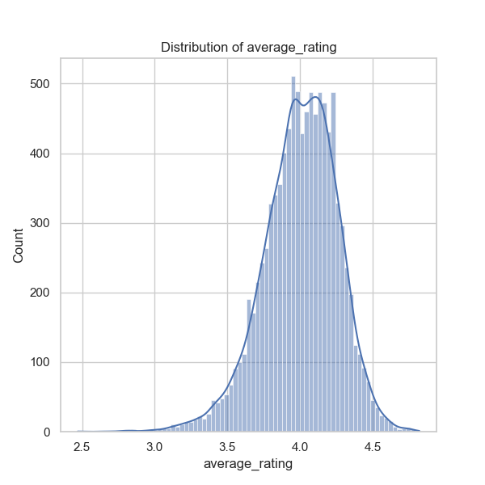
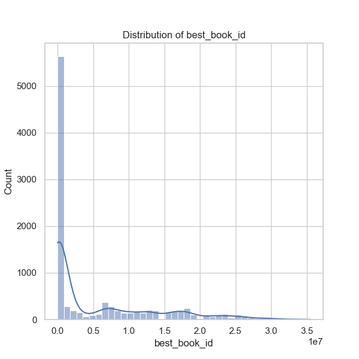
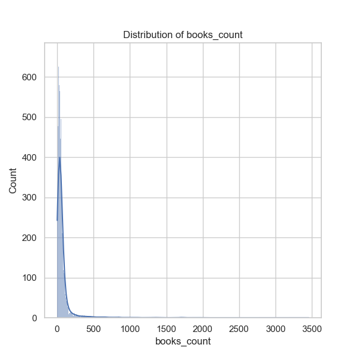
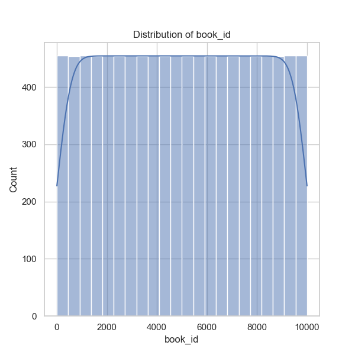
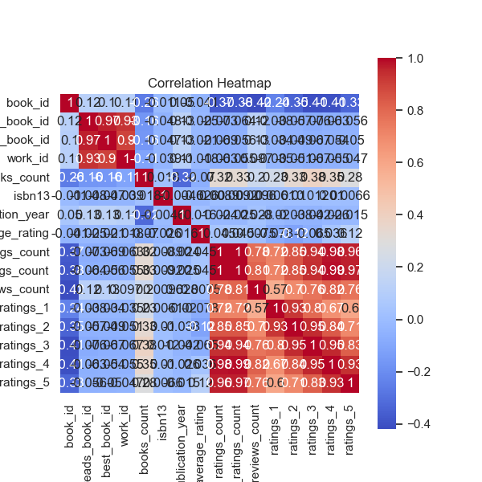
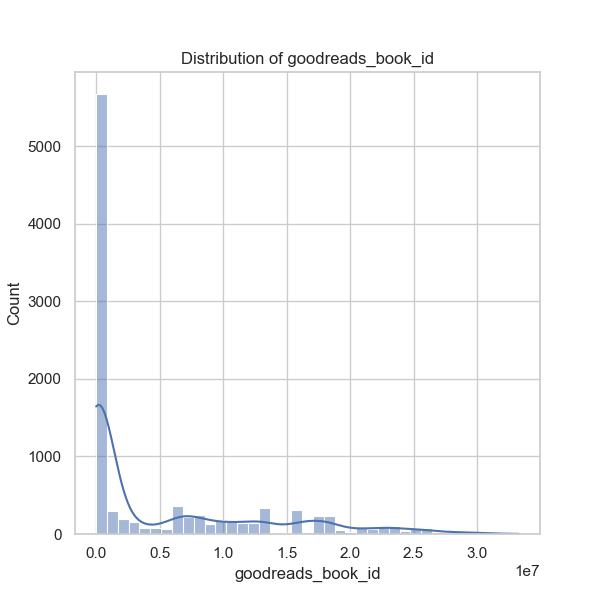
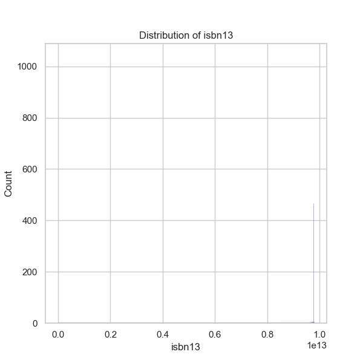
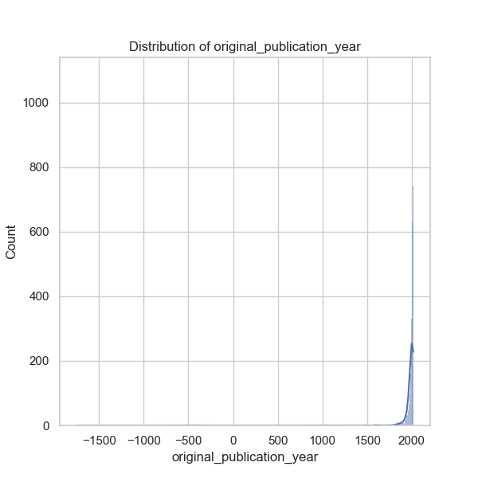
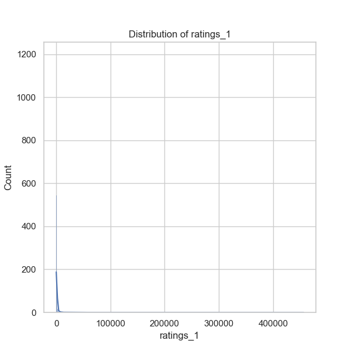
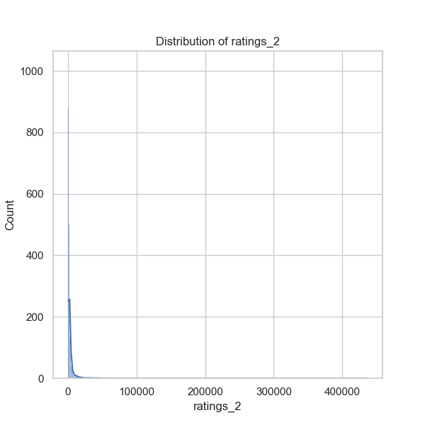
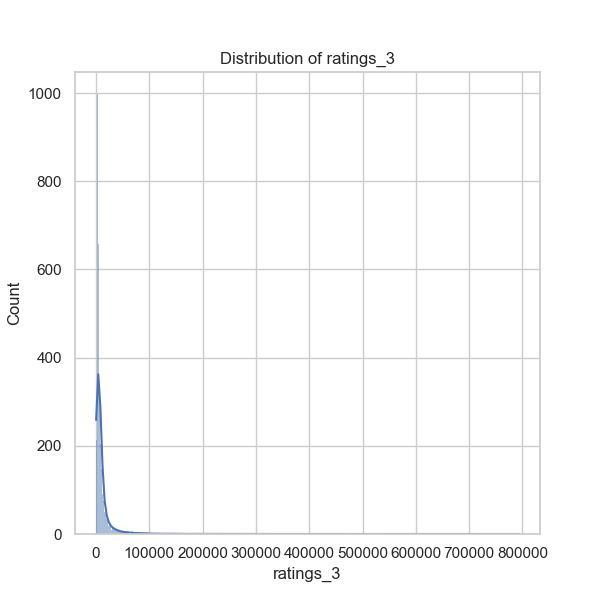
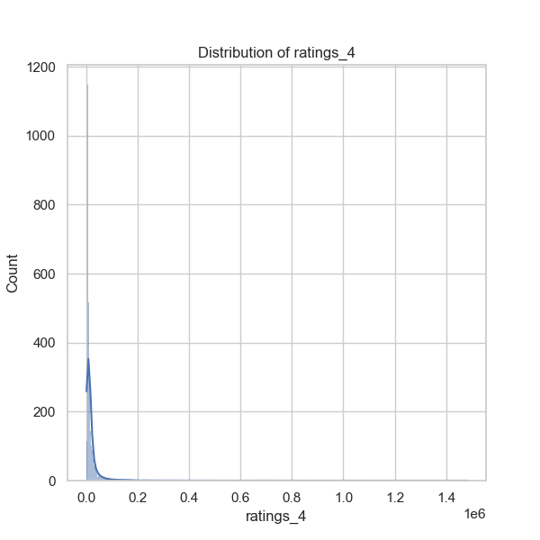
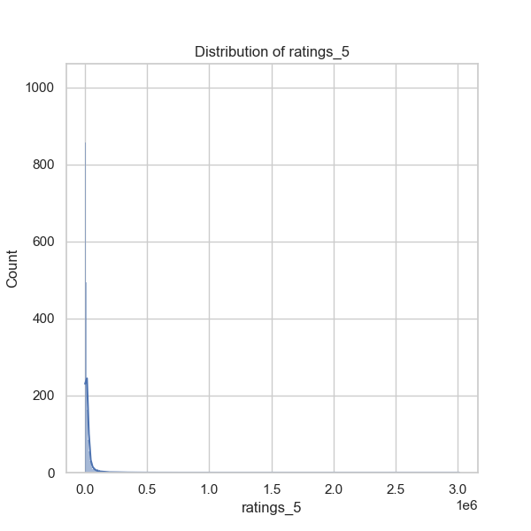
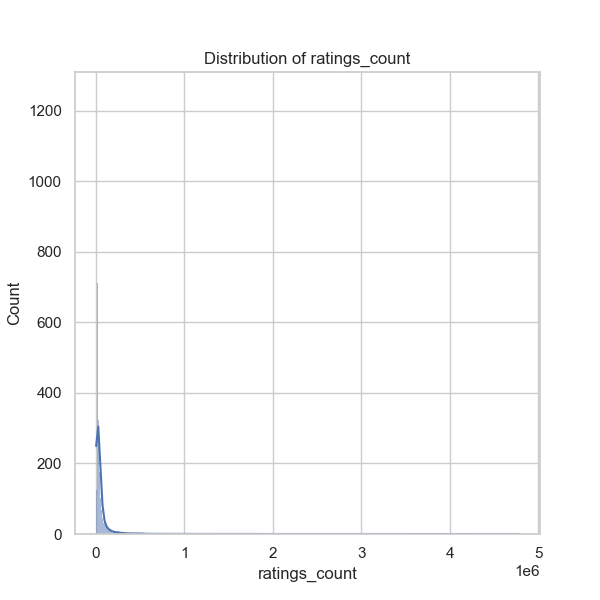
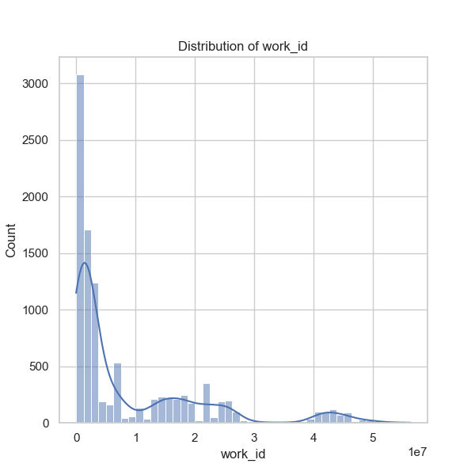
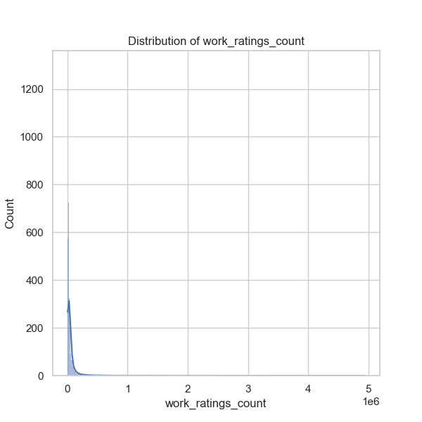
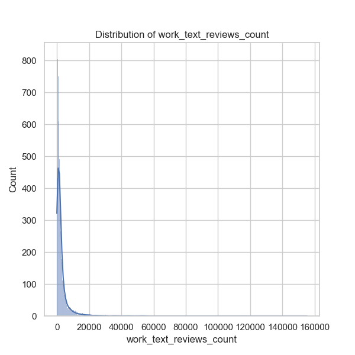