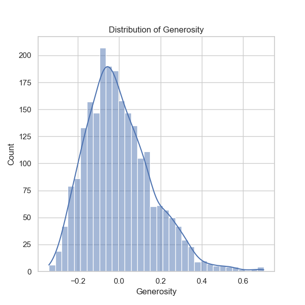

### Narrative Analysis of Happiness Data from 'happiness.csv'

The dataset under analysis, 'happiness.csv', presents multifaceted insights into the happiness levels of different countries based on a series of socio-economic indicators. This analysis aims to elucidate the trends, outliers, anomalies, and correlations within this dataset.

#### Overview of Key Metrics

1. **Time Frame**:
   - The dataset spans from 2005 to 2023, with an average year of approximately 2014.76. The variation of years implies longitudinal insights that could help track changes in happiness metrics over time.

2. **Life Ladder Scores**:
   - The average Life Ladder score (5.48) suggests a moderate level of happiness across countries. The values range from a minimum of 1.281 to a maximum of 8.019, indicating significant disparities in perceived happiness among different nations.

3. **Socio-Economic Indicators**:
   - **Log GDP per capita**: The average value, approximately 9.4, underlines a logarithmic relationship between economic wealth and happiness.
   - **Healthy Life Expectancy**: The mean is about 63.4 years, which points towards overall health outcomes that potentially influence happiness. This value varies significantly across countries, with a notable disparity between the lower and upper bounds (6.72 to 74.60 years).
   - **Freedom to Make Life Choices**: With an average of 0.75, this indicates that most respondents feel relatively empowered in making personal decisions, though the range captures differing societal structures.

#### Missing Values
The analysis uncovered several missing values, particularly in the **Healthy life expectancy**, **Generosity**, and **Perceptions of corruption** metrics. Special attention needs to be directed towards addressing these gaps, as they may bias findings or disrupt trend analyses.

#### Correlation Insights
- **Interrelated Indicators**:
  - Strong correlations are exhibited between:
    - **Life Ladder** and **Log GDP per capita** (0.78),
    - **Life Ladder** and **Social Support** (0.72),
    - **Healthy Life Expectancy** and **Log GDP per capita** (0.82).
    
  These strong positive correlations suggest that wealth and health are major contributors to happiness.

- **Negative correlations**:
  - **Perceptions of Corruption** with **Life Ladder** (-0.43) and **Negative Affect** with the measured happiness score (-0.35) indicate that corruption and negative emotions detract significantly from national happiness levels.

#### Trends and Anomalies
- **Years of Data**: The Life Ladder scores appear to be generally stable over the years but could exhibit subtle patterns indicating improvement or decline in specific countries or regions.
- **Outliers**: The low Life Ladder score of 1.281 signifies an outlier indicating potential political instability or health crises. Identifying which country this represents could reveal important contextual factors that explain low happiness.
  
#### Recommendations for Additional Analyses

1. **Clustering Analysis**:
   Utilize clustering techniques (e.g., K-means, Hierarchical Clustering) to categorize countries based on similar happiness profiles and socio-economic indicators. This would allow for the identification of distinct groups (e.g., high happiness with low GDP, etc.).

2. **Time Series Analysis**:
   Conduct a time series analysis to deduce trends in happiness scores over time. This would help ascertain if interventions in socio-economic policies have a measurable impact on happiness levels year-on-year.

3. **Anomaly Detection**:
   Implement anomaly detection algorithms to isolate countries that exhibit unusual happiness metrics compared to their economic indicators. Such insights could provide focused areas for political, social, or economic improvements.

4. **Predictive Modeling**:
   Develop predictive models (e.g., linear regression or machine learning models) to forecast future happiness scores based on historical socio-economic data. This could help policymakers in resource allocation aimed at increasing happiness.

5. **Sentiment Analysis**:
   Integrate natural language processing techniques to assess public sentiment through social media or other forms of discourse surrounding happiness metrics, potentially linking qualitative insights with quantitative data.

#### Conclusion
The analysis of 'happiness.csv' reveals significant correlations between happiness, economic prosperity, and social factors while highlighting gaps due to missing data. By pursuing additional analyses such as clustering and predictive modeling, stakeholders can gain deeper insights necessary for fostering national happiness and well-being. The rich data set provides a foundation for understanding the complexity of happiness across different nations and can guide efforts to improve life satisfaction in various socio-economic contexts.

