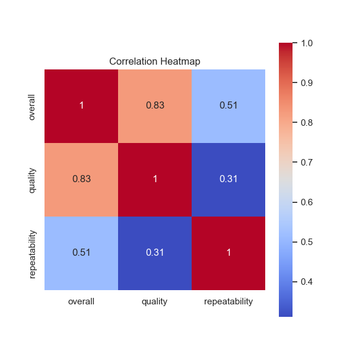
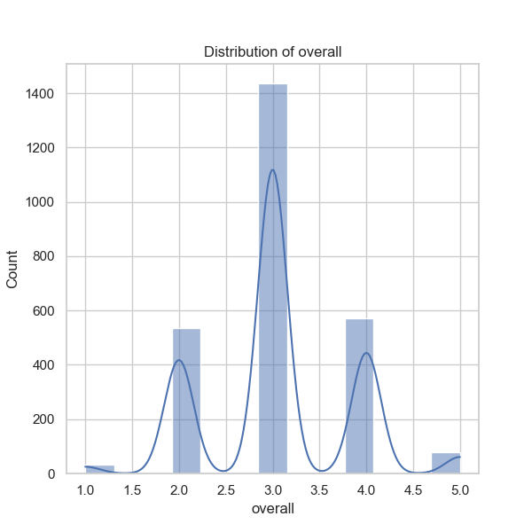
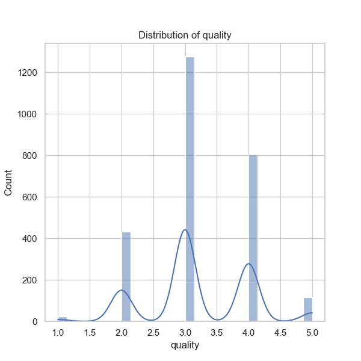
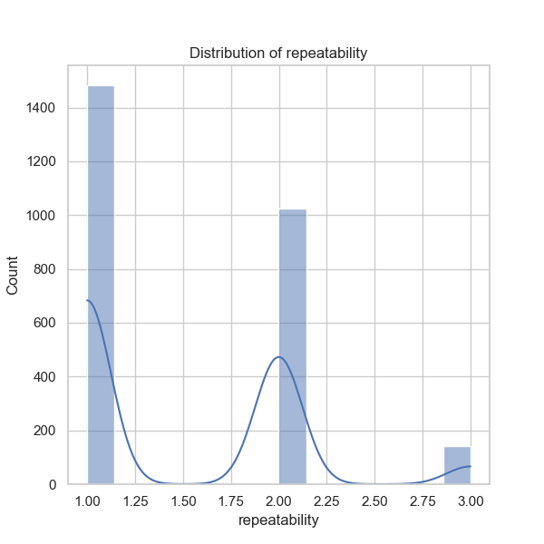

The analysis of the dataset 'media.csv' provides substantial insights into the characteristics of the media content present, as well as several trends and patterns that can guide further investigation. Below is a detailed narrative based on the summary statistics, correlations, and missing values observed in the dataset.

### General Observations

1. **Dataset Size and Structure**:
   - The dataset comprises 2,652 entries across eight columns: 'date', 'language', 'type', 'title', 'by', 'overall', 'quality', and 'repeatability'.
   - There are some missing values present particularly in the 'date' (99 entries) and 'by' (262 entries) columns. This may indicate either reporting issues or variability in data collection methods.

2. **Temporal Insights**:
   - The 'date' column has 2,055 unique entries, with the mode being '21-May-06’, which appears 8 times. This suggests a concentration of entries around specific timestamps, possibly indicating a trend in media releases or data collection cycles that should be examined further.
   - Although the mean and median for the date aren't calculable due to the non-numeric nature of the data, trends over time could be analyzed using date conversions (e.g., converting to datetime format) to assess the evolution of media content.

3. **Language Distribution**:
   - The dataset includes 11 unique languages, with English being the most common (1,306 occurrences). This dominance may reflect the global market's focus or the demographic the dataset targets.

4. **Media Type Analysis**:
   - The predominant type of media in the dataset is 'movie' with 2,211 entries, representing a significant majority. Understanding the distribution and trends among the other types (including 'series', 'documentary', etc.) may reveal consumer preferences or gaps in content types.

5. **Title Popularity**:
   - The title 'Kanda Naal Mudhal' is noted to be the most frequent (9 occurrences). Analyzing why this title appears frequently (e.g., popularity, ratings) could provide insights into consumer behavior or effective marketing strategies.

### Quality and Ratings Analysis

6. **Ratings Overview**:
   - The 'overall' rating averages around 3.05, while the quality rating is slightly higher at approximately 3.21. Both values are within the range of 1 to 5, indicating a generally moderate perception of quality and overall satisfaction among users.
   - The standard deviations of the overall (0.76) and quality (0.80) ratings suggest variability, with a significant portion of ratings likely clustering around the higher end because the quartiles indicate that 50% of ratings for both measures are 3. 

7. **Repeatability Insights**:
   - The repeatability rating is notably low with an average of 1.49, with a significant proportion (75% at quality = 2 or lower) indicating that many media pieces are not retained for repeated viewing or engagement.

### Correlation Insights

8. **Correlation Metrics**:
   - A strong positive correlation (0.82) exists between the 'overall' and 'quality' ratings, suggesting that higher perceived quality leads to higher overall ratings.
   - A moderate correlation (0.51) between 'overall' and 'repeatability' hints that while repeatable content tends to have a favorable rating, it isn't as robust a relationship.
   - The correlation coefficient between 'quality' and 'repeatability' is considerably lower (0.31), indicating that a piece can be viewed positively in quality without necessarily being engaging enough to warrant a repeat viewing.

### Recommendations for Further Analysis

To derive additional insights from the dataset, I recommend the following analyses:

1. **Time-Series Analysis**: Convert the 'date' column to a datetime object and examine trends over different time frames (monthly, yearly) in media rating performances and type popularity.

2. **Clustering Analysis**: Conduct clustering to identify segments within the data based on language, type, and ratings. This could help in identifying the audience and their preferences across different media types and languages.

3. **Sentiment Analysis**: If textual reviews are available, perform sentiment analysis on user reviews associated with media content to understand deeper sentiments beyond numerical ratings.

4. **Anomaly Detection**: Employ techniques to detect outliers in ratings, repeatability, and quality, which could uncover extreme cases or user biases in the dataset.

5. **User Demographics Study**: If demographic data is available, correlate this with viewing habits and preferences to gain a nuanced understanding of how different populations engage with media.

6. **Visual Analytics**: Implement visualizations (e.g., heatmaps, trend lines) for a clearer understanding of how various factors interplay, providing stakeholders with actionable insights.

By employing these additional analyses, a more comprehensive understanding of the media landscape and consumer behavior can be established, aiding in strategic planning and decision-making processes.

